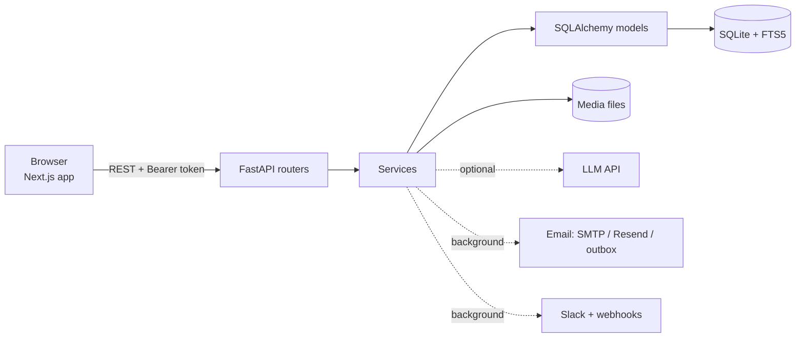
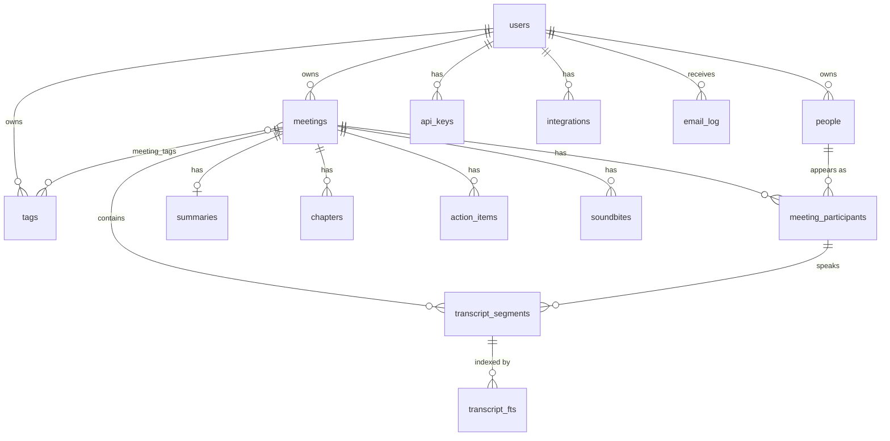

# Fireflies Clone

A meeting-notes app in the style of Fireflies.ai: add a transcript (and optionally the recording), get a summary, action items and chapters, search everything, and ask questions about your meetings. It is an original implementation with its own name and logo; it does not use any Fireflies code or branding.

**What it is not:** a meeting bot. There is no live recording, no speech-to-text, and no calendar connection. Meetings come from a recording (transcribed for you when a provider is configured) or from transcript files you upload or paste (`.vtt`, `.srt`, `.txt`, `.json`), optionally with the audio/video attached.

## Features

| Area | What works |
|---|---|
| Accounts | Sign up, log in, log out, forgot/reset password by email, change/set password, delete account, optional Google sign-in, one-click demo account. Every account only sees its own data. |
| Landing page | Public marketing page, terms, privacy. |
| Library | Meetings grouped by day, text search, filters (people, tags, dates), sorting, pagination; state lives in the URL. |
| Meeting page | Notes outline with a timestamp on every point (each one links to the line it came from), action items by person, summary styles (General, 1:1, Team Meeting, Standup, Custom) and "Refine Summary", Smart Search filters, sentiment, talk time with words per minute, topic trackers, **Identify speakers**, meeting-specific suggested questions. Synced audio/video player (or a simulated clock when there is no media), clickable transcript with the active line following playback, in-transcript search, overview / action items / chapters, edit title, people and tags, export (Markdown or plain text), delete. |
| Upload | Drag and drop with progress; media can be attached to an existing meeting. |
| Ask Fred | Chat about one meeting or all of them, with timestamped sources that jump to the moment. Works without an AI key (answers quoted from transcripts); with `LLM_API_KEY` it writes answers (Anthropic by default, or a free OpenAI-compatible provider such as Gemini or Groq via `LLM_BASE_URL`). |
| Search / Tasks / Analytics | Global transcript search with highlights, a cross-meeting task list, weekly activity, talk time, top keywords and tags. |
| Email | Recap email after each upload (to you and/or participants), welcome and reset emails, an in-app outbox with previews, a test-email button. Real delivery needs SMTP or Resend credentials. |
| Settings | Language & appearance (dark/light/system), recording & privacy (language, auto-delete, recap options), compliance notice, AI settings, knowledge base, API keys, account, security checklist. |
| Integrations | Slack incoming webhook and signed generic webhooks (test, enable/disable, delete). |
| API | Personal API keys (`ffk_…`) work on every endpoint. Swagger UI at `/docs`. |

Shown as "Coming soon" or "Not part of this version" rather than faked: calendar auto-record, live bots, Email Assistant, Live Assist, teams, MCP server, and all integrations except Slack and webhooks.

## Stack

- **Frontend:** Next.js 16 (App Router, TypeScript), Tailwind v4, shadcn/ui (Base UI), TanStack Query, sonner, Vitest.
- **Backend:** FastAPI, SQLAlchemy 2, Alembic, Pydantic v2, SQLite (WAL) with an FTS5 transcript index, PyJWT, `anthropic` SDK (optional).

## Run it locally

Needs Python 3.12 and Node 20+.

```bash
# backend  → http://localhost:8000  (Swagger UI at /docs)
cd backend
python3.12 -m venv .venv && source .venv/bin/activate
pip install -r requirements.txt
uvicorn app.main:app --reload      # migrates and seeds demo data on first start

# frontend → http://localhost:3000
cd frontend
npm install
npm run dev
```

Open http://localhost:3000 and choose **Try the demo**, or sign up. Emails go to the in-app outbox unless you configure SMTP/Resend (see `backend/.env.example`).

Checks:

```bash
cd backend && pytest
cd frontend && npm run typecheck && npm run lint && npm test && npm run build
```

## Architecture



Routers parse requests and call services; services hold the logic; models talk to the database. Every route has Pydantic request and response schemas, and the frontend types are generated from the OpenAPI schema (`npm run gen:types`), so a renamed field fails the type check instead of failing at runtime.

## Data model



All transcript times are integer milliseconds. `transcript_fts` is an FTS5 external-content table kept in sync by triggers.

## API

Interactive docs at `/docs`. Auth is `Authorization: Bearer <login token or ffk_ API key>`.

| Group | Endpoints |
|---|---|
| Auth | `POST /api/auth/{signup,login,demo,google,forgot-password,reset-password}`, `GET /api/auth/config` |
| Account | `GET/PATCH/DELETE /api/me`, `POST /api/me/password` |
| Meetings | `GET/POST /api/meetings`, `GET/PATCH/DELETE /api/meetings/{id}`, `GET /api/meetings/{id}/export` |
| Media | `POST/DELETE /api/meetings/{id}/media`, `GET /api/media/{id}` (signed, supports Range) |
| Transcript | `GET /api/meetings/{id}/transcript`, `GET …/transcript/search` |
| Summary | `POST /api/meetings/{id}/summary/regenerate` |
| Action items | `POST /api/meetings/{id}/action-items`, `PATCH/DELETE /api/action-items/{id}`, `GET /api/tasks` |
| Ask | `POST /api/meetings/{id}/ask`, `POST /api/ask` |
| Search & lists | `GET /api/search`, `/api/people`, `/api/tags`, `/api/analytics` |
| Settings | `GET/PATCH /api/settings`, `GET /api/settings/security`, `POST /api/settings/email/test`, `GET /api/emails[/{id}]` |
| Keys & integrations | `GET/POST/DELETE /api/api-keys`, `GET/POST/PATCH/DELETE /api/integrations`, `POST /api/integrations/{id}/test` |
| Health | `GET /api/health` |

## Configuration

All backend settings are environment variables (or `backend/.env`); see [`backend/.env.example`](backend/.env.example). The frontend needs only `NEXT_PUBLIC_API_URL`.

## Deploying

See [`docs/DEPLOY.md`](docs/DEPLOY.md): Railway (backend, with a volume) and Vercel (frontend).

## Assumptions and limits

- **Speech-to-text needs a provider.** A recording uploaded on its own is transcribed with Whisper through the same OpenAI-compatible provider as the AI features (Groq is free; 25 MB per recording; speakers are not told apart, so every line is "Speaker"). Without a provider, upload a transcript and attach the recording.
- **Without `LLM_API_KEY`**, summaries are heuristic (extractive) and Ask Fred answers by quoting matching transcript lines. The AI code paths are covered by tests using a fake model; they have not been run against a live model here.
- **Email** is only delivered when SMTP or Resend is configured. Otherwise it is rendered and kept in the outbox.
- **SQLite** means one backend instance with a persistent volume. It is a fit for this scale, not for horizontal scaling.
- Login throttling is in memory, so it resets on restart and is per instance.
- Webhook targets must be public HTTPS addresses (private ranges and redirects are refused).
- The sample data is invented.

## Documentation

- [`docs/DECISIONS.md`](docs/DECISIONS.md): why things are the way they are, phase by phase.
- [`docs/DEPLOY.md`](docs/DEPLOY.md): deployment.
- [`docs/reference/`](docs/reference): design tokens and the screenshot index used for the look and layout.
