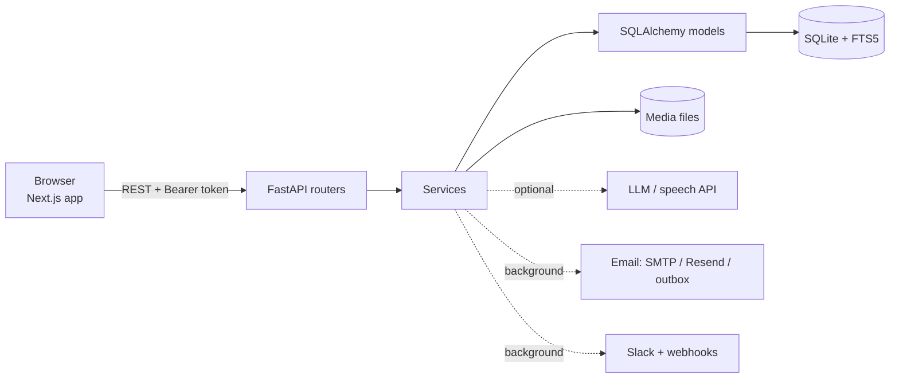
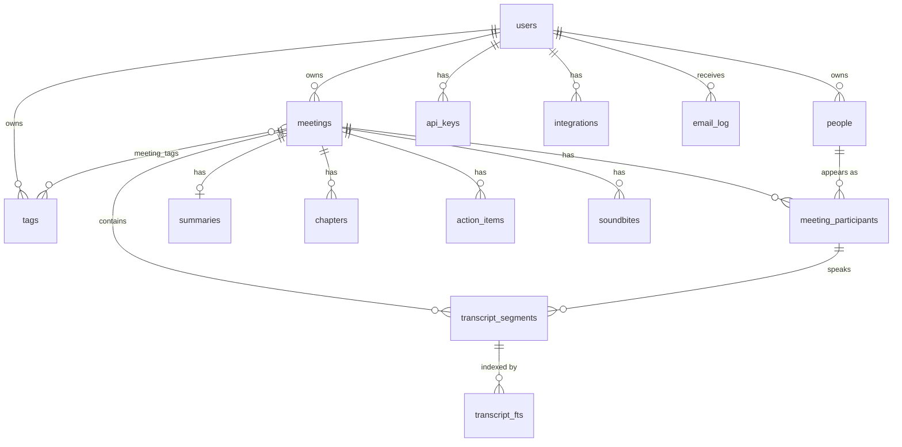

# Fireflies Clone

A meeting-notes web app modelled on the Fireflies.ai experience: a meetings library, a meeting page with an interactive transcript and media player, AI-style summaries with action items and chapters, global search, exports, tags, and an "Ask Fred" chat about your meetings.

It is an original implementation. It has its own name and logo and uses no Fireflies code or brand assets.

- **Run it:** see [Setup instructions](#setup-instructions). Choose **Try the demo** on the landing page; no sign-up is needed.
- **Overview video (1 min 35 s, narrated):** [docs/demo/overview.mp4](docs/demo/overview.mp4)
- **Live demo:** add your hosted link here after deploying ([docs/DEPLOY.md](docs/DEPLOY.md)).

## Contents

1. [Assessment coverage](#assessment-coverage)
2. [Tech stack](#tech-stack)
3. [Setup instructions](#setup-instructions)
4. [Architecture overview](#architecture-overview)
5. [Database schema](#database-schema)
6. [API](#api)
7. [Assumptions](#assumptions)
8. [Testing](#testing)
9. [Further documentation](#further-documentation)

## Assessment coverage

### Core features

| # | Requirement | Where it is |
|---|---|---|
| 1 | **Meetings library / dashboard**: title, date, duration, participants; search and filter by title, date, participant; sort by recency; navbar with profile/settings | `/meetings`. Meetings are grouped by day. Filters (people, tags, date range), sorting and pagination are kept in the URL. Profile menu and settings in the top bar and sidebar. |
| 2 | **Meeting / transcript detail**: speaker labels and timestamps; media player with seek bar; click a line to seek and the reverse; search with highlights | `/meetings/{id}`. The player uses the attached recording (every seeded meeting has one) or a simulated clock when there is none. The active line follows playback. In-transcript search highlights matches and steps through them. |
| 3 | **AI summary and notes**: summary, action items, key topics / chapters | Notes outline with a timestamp on every point (nested sub-points with figures and dates), overview, keywords, action items grouped by person, five summary styles plus "Refine Summary". Generated by an LLM when one is configured, otherwise by a built-in extractive generator. |
| 4 | **CRUD**: create (upload or paste a transcript, or a form), edit metadata, delete, add/edit/complete action items, everything persists | Upload page (`.vtt`, `.srt`, `.txt`, `.json`, or a recording to transcribe), edit title/people/tags on the meeting page, delete, action items can be added, edited, assigned, dated, completed and deleted. All data is stored in SQLite. |
| 5 | **Fireflies experience**: navigation, panels, forms, modals, search, filters, toasts, settings | Sidebar, three-panel meeting page, dark and light themes, toasts for every action, settings pages (appearance, recording and privacy, AI, API keys, integrations, team). |

### Placeholders (shown as "Coming soon")

Live meeting bot, calendar auto-record, Zoom/Meet/CRM integrations, team sharing and collaboration. Real accounts are built (sign up, log in, reset by email) in addition to the one-click demo user.

### Bonus

| Bonus | Status |
|---|---|
| Comments / highlights / soundbites | Done: bookmark any transcript line (or range), add a note, jump back to it. |
| Export transcript or summary | Done: PDF, Markdown and plain text. |
| Global search across all meetings | Done: full-text (SQLite FTS5) with highlighted snippets. |
| Tags / topics and filtering | Done: tags (channels) per meeting, filter by tag, topic trackers on the meeting page. |
| "Ask a question about this meeting" chat | Done: per meeting and across all meetings, with timestamped sources that jump to the moment. |
| Dark mode | Done (dark, light, system). |

### Also built beyond the brief

Sign up / log in / password reset, personal API keys, Slack and generic webhooks, recap emails (with an in-app outbox), speaker identification, sentiment, talk-time and topic-tracker insights, analytics, and speech-to-text for recordings uploaded without a transcript.

### Sample data

On first start the database is seeded with 7 meetings, each with a full transcript, speakers, summary with nested notes, chapters, keywords, action items, tags and a spoken recording (generated audio, so click-to-seek works out of the box). The sample data is invented.

## Tech stack

| Layer | Choice |
|---|---|
| Frontend | Next.js 16 (App Router, TypeScript), Tailwind CSS v4, shadcn/ui (Base UI), TanStack Query, sonner (toasts), Vitest |
| Backend | Python 3.12, FastAPI, SQLAlchemy 2.0, Alembic, Pydantic v2, PyJWT, fpdf2 (PDF export) |
| Database | SQLite in WAL mode, with an FTS5 full-text index on transcripts |
| AI (optional) | Any OpenAI-compatible chat and speech-to-text API (Groq by default, Gemini and OpenRouter also work). Without a key the app still works: summaries are extractive and Ask Fred quotes transcript lines. |
| Types | Frontend API types are generated from the backend's OpenAPI schema (`npm run gen:types`) |

## Setup instructions

Needs **Python 3.12** and **Node 20+**.

```bash
# 1. Backend  ->  http://localhost:8000   (Swagger UI at /docs)
cd backend
python3.12 -m venv .venv
source .venv/bin/activate
pip install -r requirements.txt
cp .env.example .env              # optional: add keys, see below
uvicorn app.main:app --reload     # creates the database, runs migrations, seeds demo data
```

```bash
# 2. Frontend  ->  http://localhost:3000
cd frontend
npm install
npm run dev
```

Open http://localhost:3000 and click **Try the demo**.

**Useful commands**

```bash
python -m app.seed.seed --reset        # wipe and reseed the demo data
npm run gen:types                      # regenerate frontend API types (backend must be running)
```

**Configuration** is by environment variables or `backend/.env` (full list in [`backend/.env.example`](backend/.env.example)). Nothing is required to run locally. Useful ones:

| Variable | Purpose |
|---|---|
| `LLM_API_KEY` | Turns on model-written summaries, Ask Fred answers and speech-to-text. Default provider is Groq (`LLM_BASE_URL`, `LLM_MODEL`, `STT_MODEL` change it). |
| `GOOGLE_CLIENT_ID` | Enables "Continue with Google". |
| `SMTP_*` or `RESEND_API_KEY` | Real email delivery. Without them emails go to the in-app outbox. |
| `DB_PATH`, `MEDIA_DIR` | Where the SQLite file and uploaded recordings live. |
| `CORS_ORIGINS`, `FRONTEND_URL` | Needed when the frontend is hosted on another origin. |
| `NEXT_PUBLIC_API_URL` | Frontend setting: the backend's URL (default `http://localhost:8000`). |

## Architecture overview



- **Layering:** routers parse the request and call a service; services hold all business logic; models talk to the database. No SQL or logic in routers.
- **Contracts:** every route has Pydantic request and response schemas. Frontend types are generated from them, so a renamed field fails the type check instead of failing at runtime.
- **Frontend:** App Router pages are thin; features live in small components under `components/<feature>/`, server state in TanStack Query hooks under `hooks/`. Design tokens (colours, type sizes, spacing) are CSS variables in `app/globals.css`, with a dark and a light set.
- **Player:** one controller owns the audio element and the clock. The transcript, seek bar, notes timestamps and soundbites all seek through it.
- **Summaries:** notes are stored as an indented bullet list in `chapters.summary` (`- point {@ms}` with `  - detail` underneath), each top-level point carrying the transcript moment it came from.
- **Search:** SQLite FTS5 external-content table kept in sync by triggers; match offsets come from the database, so highlighting respects stemming.
- **Isolation:** every row is owned by a user; every query filters by owner. Recordings are served through signed, per-meeting URLs that support HTTP Range (so seeking works).
- **Timestamps:** all transcript times are integer milliseconds.

## Database schema



| Table | Columns (PK = primary key, → = foreign key) |
|---|---|
| `users` | id PK, name, email (unique), avatar_url, password_hash, google_sub, is_demo, settings (JSON), created_at |
| `meetings` | id PK, owner_id → users, title, started_at, duration_ms, source (upload / paste / form / seed), media_url, media_path, media_type, status (processing / ready / failed), created_at, updated_at |
| `people` | id PK, owner_id → users, name, email |
| `meeting_participants` | id PK, meeting_id → meetings, person_id → people, speaker_label, color_index |
| `transcript_segments` | id PK, meeting_id → meetings, participant_id → meeting_participants, seq, start_ms, end_ms, text. Unique (meeting_id, seq); index on (meeting_id, start_ms) |
| `summaries` | id PK, meeting_id → meetings (unique), overview, keywords (JSON), generated_by (seed / heuristic / llm), generated_at |
| `chapters` | id PK, meeting_id → meetings, seq, title, start_ms, summary (the notes for that section) |
| `action_items` | id PK, meeting_id → meetings, text, assignee_participant_id → meeting_participants, source_segment_id → transcript_segments, due_date, is_completed, completed_at, created_at, updated_at |
| `soundbites` | id PK, meeting_id → meetings, start_segment_id and end_segment_id → transcript_segments, note, created_at |
| `tags` | id PK, owner_id → users, name, color. Unique per owner (the service also rejects case-only duplicates) |
| `meeting_tags` | meeting_id → meetings and tag_id → tags (composite PK) |
| `api_keys` | id PK, user_id → users, name, prefix, key_hash (unique; the key itself is never stored), created_at, last_used_at |
| `integrations` | id PK, user_id → users, kind (slack / webhook), name, config (JSON), enabled, last_status, last_run_at |
| `email_log` | id PK, user_id → users, meeting_id → meetings, to_email, subject, html, text, transport, status, error, created_at |
| `transcript_fts` | FTS5 virtual table over `transcript_segments.text`, maintained by insert/update/delete triggers |

Design notes:

- **People are separate from participants.** `people` is a per-user address book; `meeting_participants` is one person's role in one meeting (speaker label and colour). That lets one person appear in many meetings and be renamed once, while a meeting keeps its own speaker labels.
- **Segments are the source of truth for time.** Action items and soundbites point at segments, not at copied timestamps, so they stay correct if a transcript line is re-timed.
- **Children cascade on delete**, so deleting a meeting removes its transcript, summary, chapters, action items, soundbites and tag links (and its recording file).
- **Migrations** are Alembic and run on startup; tests build their database with the same migrations, so the FTS triggers are exercised.

## API

Interactive docs at `/docs`. Auth is `Authorization: Bearer <login token or ffk_ API key>`.

| Group | Endpoints |
|---|---|
| Auth | `POST /api/auth/{signup,login,demo,google,forgot-password,reset-password}`, `GET /api/auth/config` |
| Account | `GET/PATCH/DELETE /api/me`, `POST /api/me/password` |
| Meetings | `GET/POST /api/meetings`, `GET/PATCH/DELETE /api/meetings/{id}`, `GET /api/meetings/{id}/export?format=pdf\|md\|txt` |
| Media | `POST/DELETE /api/meetings/{id}/media`, `GET /api/media/{id}` (signed, supports Range) |
| Transcript | `GET /api/meetings/{id}/transcript`, `GET …/transcript/search`, `POST …/speakers/identify` |
| Summary | `POST /api/meetings/{id}/summary/regenerate` |
| Action items | `POST /api/meetings/{id}/action-items`, `PATCH/DELETE /api/action-items/{id}`, `GET /api/tasks` |
| Soundbites | `GET/POST /api/meetings/{id}/soundbites`, `PATCH/DELETE /api/soundbites/{id}` |
| Ask | `POST /api/meetings/{id}/ask`, `POST /api/ask`, `GET /api/meetings/{id}/suggestions` |
| Search and lists | `GET /api/search`, `/api/people`, `/api/tags`, `/api/analytics` |
| Settings | `GET/PATCH /api/settings`, `POST /api/settings/email/test`, `GET /api/emails` |
| Keys and integrations | `GET/POST/DELETE /api/api-keys`, `GET/POST/PATCH/DELETE /api/integrations` |
| Health | `GET /api/health` |

## Assumptions

- **A default logged-in user** is assumed by the brief, so the landing page's *Try the demo* signs in as the seeded user in one click. Real accounts also exist, and each account only sees its own data.
- **Speech-to-text** is a placeholder in the brief. Here it works when a provider key is set (a recording uploaded alone is transcribed; speakers are not told apart, use *Identify speakers*). Without a key, upload a transcript and optionally attach the recording.
- **AI features need a key to be model-written.** Without `LLM_API_KEY`, summaries are extractive and Ask Fred quotes the best matching transcript lines. Both paths are covered by tests; the model paths use a fake model in tests.
- **Seeded recordings are synthetic speech** generated from the seed transcripts so playback and click-to-seek work with no external files.
- **Plain-text transcripts have no timings**, so times are estimated at about 150 words per minute.
- **Email** is delivered only when SMTP or Resend is configured; otherwise it is rendered and kept in the in-app outbox.
- **SQLite** means one backend instance with a persistent volume. That suits this scale, not horizontal scaling.
- **PDF export** uses a built-in font, so characters outside Latin-1 appear as `?` in the PDF only.
- **Login throttling** is in memory, so it resets on restart.
- **Webhook targets** must be public HTTPS addresses.
- **Look and feel** follows the reference screenshots for layout, spacing and colours, with original wordmark and icons.

## Testing

```bash
cd backend && pytest
cd frontend && npm run typecheck && npm run lint && npm test && npm run build
```

Backend tests cover the API, search, migrations, seeding, auth isolation, media streaming, export and the summary/notes logic. Frontend tests cover the helpers and the API client.

`sample-meeting/` holds files for trying uploads by hand: transcripts in several formats and recordings in several formats (see its README).

## Further documentation

- [`docs/DECISIONS.md`](docs/DECISIONS.md): why things are the way they are, phase by phase.
- [`docs/DEPLOY.md`](docs/DEPLOY.md): hosting.
